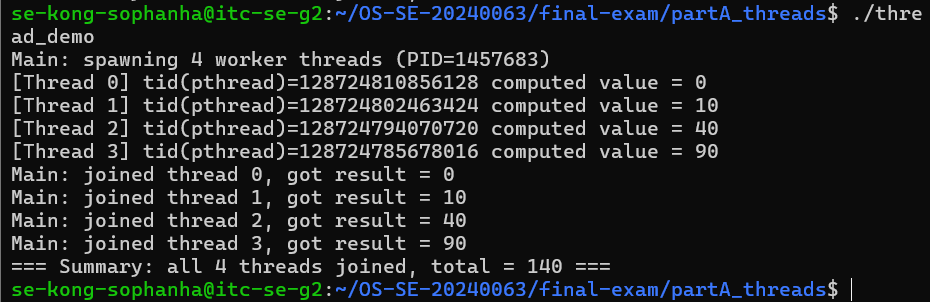
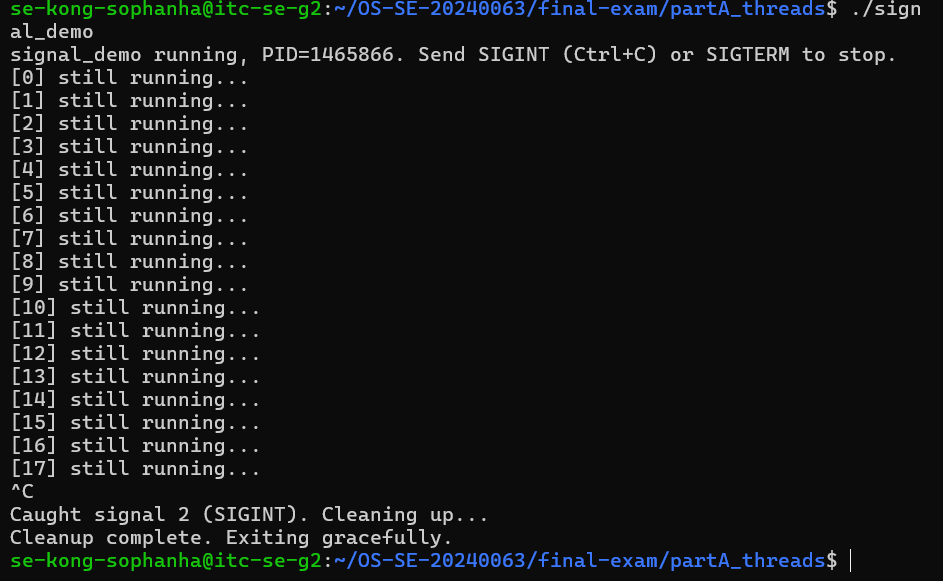
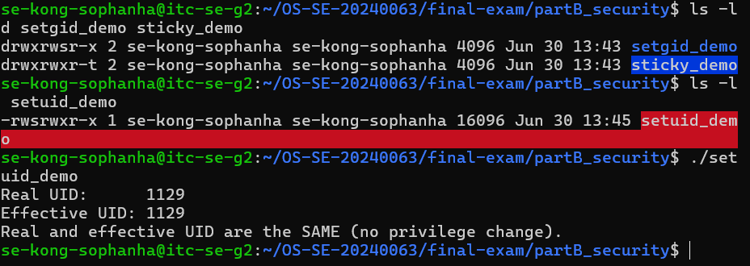
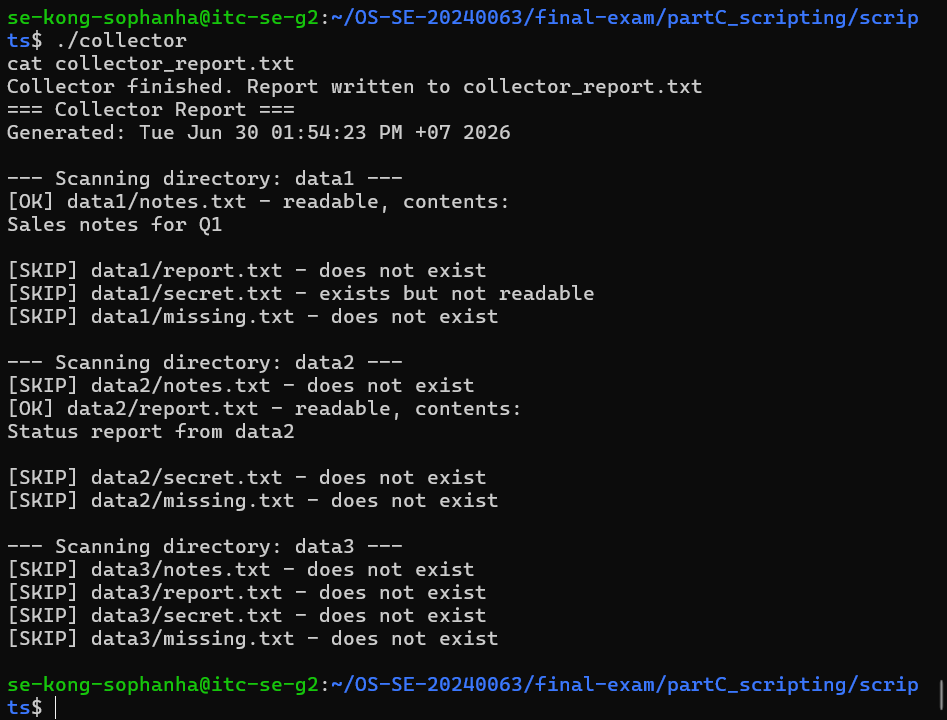
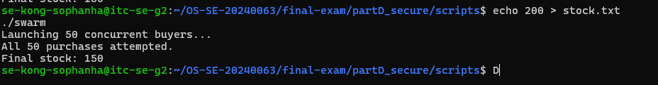
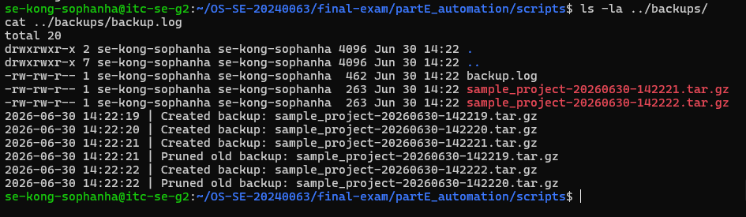

# Final Exam — Kong Sophanha

\`\`\`
Student name: Kong Sophanha
Student ID: p20240063
Server username: se-kong-sophanha
Exam scenario value (COMPANY / PRODUCT): TechCorp / Widget
Date & start time: 2026-06-30, approx 13:13
AI assistant used (name/none): Claude (Anthropic)
\`\`\`

> Exact commands per part are in `commands.md`. Live-curveball answers are in `live_mods.md`.

---

## Part A — Threads, Kernel Mapping & Signals

**Screenshots**

**Written (one short answer)**
- **Why does a worker thread's joined result reach the main thread, but a forked child's value would not?**
  A thread shares the same address space as the main thread, so a value it computes lives in memory both can see; `pthread_join` simply reads that shared memory through the returned pointer. A forked child, by contrast, gets a copy-on-write copy of the parent's entire memory at the moment of `fork()` — it is a separate process with its own address space, so anything it modifies afterward only exists in its own copy. The parent never sees those changes directly; it would need an explicit communication mechanism (pipe, shared memory segment, or just the exit status via `wait()`) to get any value back.

**Anything not completed:** none

---

## Part B — Files, Permissions & Special Bits

**Screenshot**

**Written (one short answer)**
- **Translate your private file's final octal mode into the 9-char symbolic string** (e.g. `600` → `rw-------`).
  octal `600` → `rw-------`

**Anything not completed:** none

---

## Part C — Bash Scripting, PATH & Safe File Scanning

**Screenshot**

**Written (one short answer)**
- **Why did `greeter` fail to run by name before you added your `bin` directory to PATH?**
  The shell only searches the directories listed in `$PATH` when resolving a bare command name. A script sitting in an arbitrary folder (like `final-exam/partC_scripting/scripts/`) isn't found unless that folder is added to `$PATH`, or invoked explicitly with `./greeter` or a full path. In my case `~/bin` was already in `$PATH` from earlier coursework setup, so once I copied `greeter` into `~/bin/`, it resolved immediately by name.

**Anything not completed:** none

---

## Part D — Concurrency, a Race Condition & File Locking

**Screenshot**

**Written (one short answer)**
- **Why did the unpatched `swarm` sometimes leave more stock than the correct final value (with `200` stock and `50` concurrent buyers)?**
  Each `buy_widget` process reads the current stock, checks it, computes a new value, then writes it back — but this read-modify-write is not atomic. When many buyers run concurrently, several can read the same stale stock value before any of them writes back. Whichever write happens last simply overwrites the others, so multiple successful "purchases" only count as a single decrement — leaving more stock than the correct 150. In my own unpatched runs the race was severe enough that stock even went briefly negative (-1) on one run, because two processes could pass the "enough stock?" check against the same stale value and both decrement.

**Anything not completed:** none — D3's `flock` lock reproducibly fixes it to exactly 150 every run.

---

## Part E — Backups, Archiving & cron Automation

**Screenshot**

**Written (one short answer)**
- **Archiving vs compression — which one actually shrank the bytes, and why?**
  `tar` only archives — it bundles multiple files/directories into one stream without reducing their size. The actual byte reduction comes from the `-z` (gzip) compression step, which finds redundancy in the data and encodes it more compactly. Archiving solves "many files into one file"; compression solves "fewer bytes."

**Anything not completed:** none
