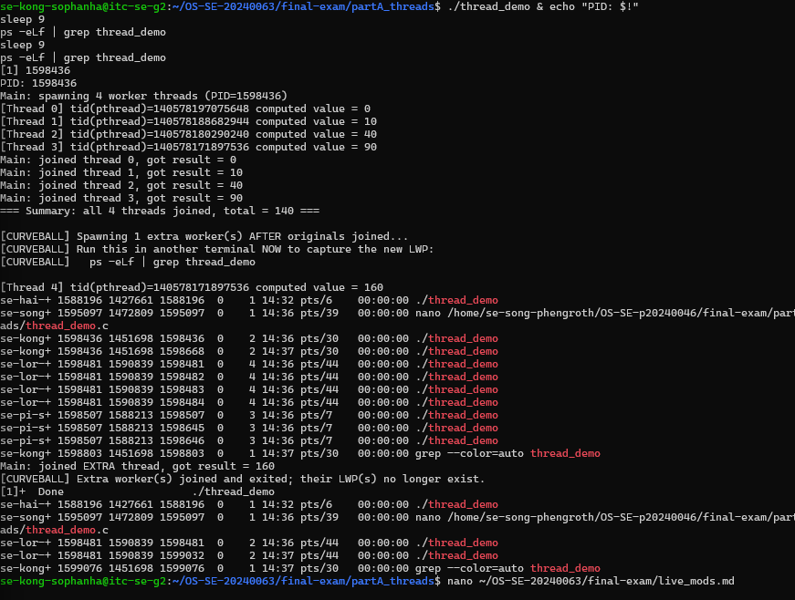
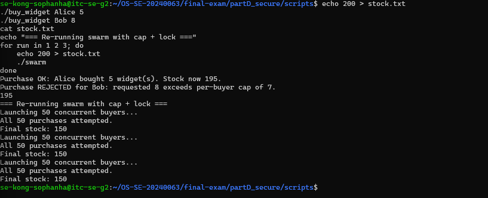
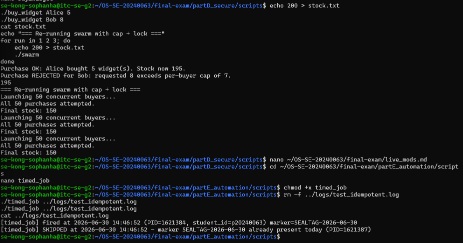

# live_mods.md — Live Modification (curveball) answers

> Released once, late in the exam. **Three curveballs: A, D, E.** For EACH, give: the
> announced instruction, the exact command(s) you ran, the **live value(s)** you acted
> on (your PID / stock / timestamp), and the screenshot. An answer that ignores your
> issued value, or that could have been written *before* the announcement, scores zero.

---

## Curveball A — extra worker(s) that start after the others join
- **Issued value:** `1` extra worker(s)
- **Announced instruction:** Edit `thread_demo.c` to spawn this many extra workers
  that start only after the originals have joined; show the new LWP(s) appear in
  the mapping then disappear.
- **Live value(s) I acted on:** base PID = `1598436`; new LWP id that appeared =
  `1598668`
- **Commands:**
```bash
nano thread_demo.c   # added extra-worker block after the join loop, before return 0
gcc -pthread thread_demo.c -o thread_demo
./thread_demo & echo "PID: $!"
sleep 9
ps -eLf | grep thread_demo
sleep 9
ps -eLf | grep thread_demo
```
- **Screenshot:**


## Curveball D — per-buyer purchase cap
- **Issued value:** cap = `7`
- **Announced instruction:** Add a per-buyer purchase cap to your purchase script
  (`buy_widget`) — reject any single order above it; re-run `swarm` and show the
  locked result respects the cap and stays consistent.
- **Live value(s) I acted on:** stock before = `200`; order rejected for exceeding
  the cap = Bob's order of `8` (cap is `7`); final stock after swarm re-runs = `150`
  (consistent across all 3 runs)
- **Commands:**
```bash
nano buy_widget   # added PURCHASE_CAP=7 check after quantity validation
echo 200 > stock.txt
./buy_widget Alice 5
./buy_widget Bob 8
cat stock.txt
for run in 1 2 3; do
    echo 200 > stock.txt
    ./swarm
done
```
- **Screenshot:**


## Curveball E — idempotent timed_job
- **Issued value:** token = `SEALTAG`
- **Announced instruction:** Make `timed_job` idempotent using this marker token —
  it must refuse to run if the token for today is already in its log; trigger it
  twice and prove the 2nd was skipped.
- **Live value(s) I acted on:** today's marker line = `SEALTAG-2026-06-30`; 1st
  trigger = fired (PID 1621384), 2nd trigger = skipped (PID 1621387)
- **Commands:**
```bash
nano timed_job   # added TOKEN="SEALTAG", marker check via grep before firing
chmod +x timed_job
rm -f ../logs/test_idempotent.log
./timed_job ../logs/test_idempotent.log
./timed_job ../logs/test_idempotent.log
cat ../logs/test_idempotent.log
```
- **Screenshot:**

