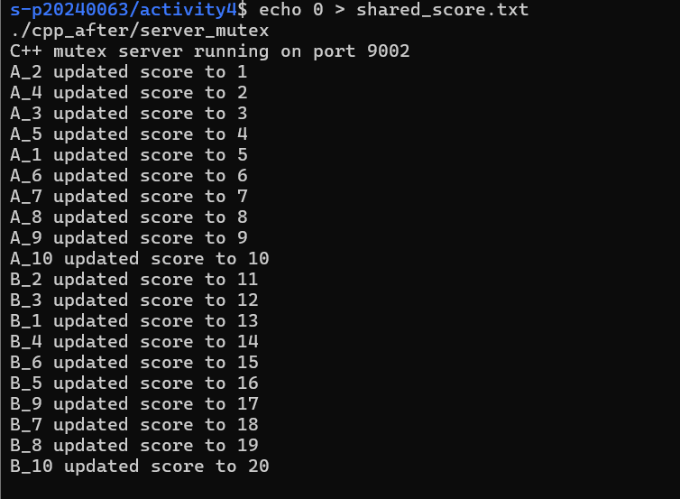
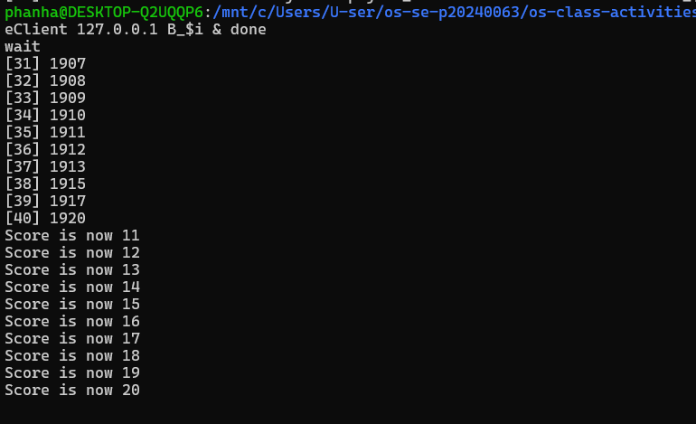

# Class Activity 4 — Shared File API

- **Student Name:** Kong Sophanha
- **Student ID:** P20240063
- **Partner Name:** None (solo)
- **Server IP Address:** 127.0.0.1

---

## Task 1: C++ Before Mutex

- Expected score: 20
- Actual score: 2
- What happened: Race condition — all threads read the same value at the same time and overwrote each other.

---

## Task 2: C++ After Mutex

- Expected score: 20
- Actual score: 20
- What changed: std::mutex forced threads to update one at a time.

---

## Task 3: Java Before Synchronized

- Expected score: 20
- Actual score: 2
- What happened: Same race condition as C++ — threads read and wrote simultaneously.

---

## Task 4: Java After Synchronized

- Expected score: 20
- Actual score: 20
- What changed: synchronized keyword forced one thread at a time into updateScore().

---

## Questions

1. Clients send requests to the server so only one program controls the file, reducing direct conflicts.
2. The server still has a race condition because multiple threads handle clients simultaneously and access the file at the same time.
3. std::lock_guard<std::mutex> protects the file read, sleep, and write operations from being run by multiple threads at once.
4. synchronized protects the entire updateScore() method so only one thread can execute it at a time.
5. Student A sends 10 requests and Student B sends 10 requests, totaling 20 increments expected.
6. Two separate servers could read the same value simultaneously and both write the same incremented value, causing lost updates.

---

## Reflection
C++ uses std::mutex with lock_guard for RAII-style locking, while Java uses the synchronized keyword directly on the method. Both achieve the same result — only one thread updates the file at a time. This activity showed that even with a server as a middleman, synchronization is still needed when multiple threads share a resource.
