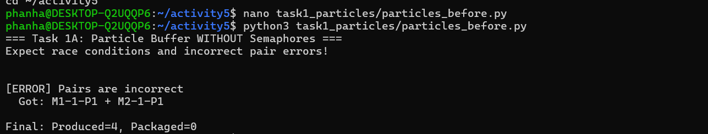
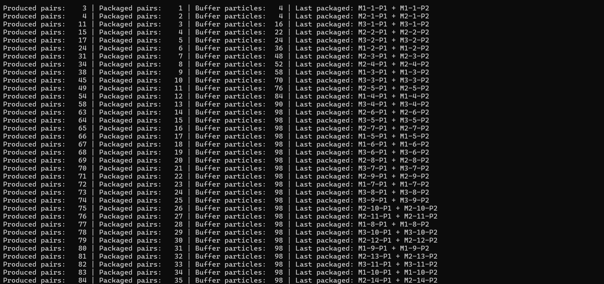
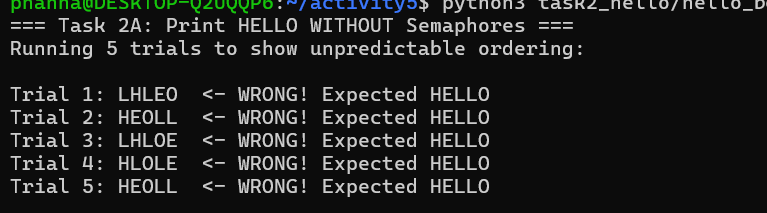
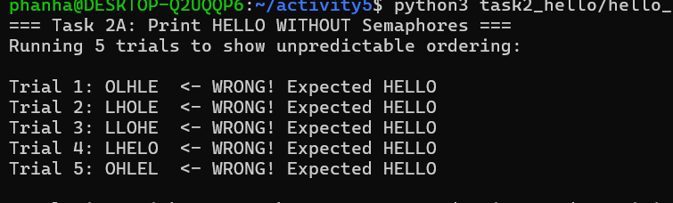

# Class Activity 5 - Semaphores

- **Student Name:** Kong Sophanha
- **Student ID:** P20240063
- **Programming Language Used:** Python

---

## Task 1A: Particle Pair Buffer Before Semaphores

- **What error or incorrect behavior appeared:** The program detected a pair mismatch — P1 and P2 from different producer machines ended up packaged together, triggering the "Pairs are incorrect" error.
- **Why did this happen without semaphore protection:** Without semaphores, multiple producer threads interleave their writes to the buffer. Thread A writes P1, then gets interrupted before writing P2, allowing Thread B to write its own P1 in between. The consumer then picks up two particles that don't belong to the same pair.

---

## Task 1B: Particle Pair Buffer After Semaphores

- **Number of producer machines:** 3
- **Buffer capacity:** 100 particles (50 pairs)
- **Semaphores used:** `empty_pairs` (starts at 50), `full_pairs` (starts at 0), `mutex` (starts at 1)
- **Packaged pair count shown in screenshot:** 
- **Did any error appear during normal operation?** No

---

## Task 2A: HELLO Before Semaphores

- **Output before semaphore ordering:** Random incorrect orders such as HLOEL, LHOLE, OHLLE across trials
- **Why this output can be wrong or unpredictable:** The three threads are started at the same time with no ordering constraints. The OS scheduler decides which thread runs first, so whichever thread gets CPU time prints its letter immediately regardless of correct order.

---

## Task 2B: HELLO After Semaphores

- **Processes or threads used:** 3 threads (Process 1, Process 2, Process 3)
- **Semaphores used:** `start_h` (1), `after_he` (0), `after_l1` (0), `after_l2` (0)
- **Final output:** HELLO

---

## Questions

1. **In Task 1, why does a producer need to wait before adding a pair to the buffer?**
   The producer must wait because the buffer has a fixed capacity of 100 particles (50 pairs). If it adds particles without checking, it could overflow the buffer and corrupt data. The `empty_pairs` semaphore counts available slots and blocks the producer until space exists.

2. **In Task 1, why does the consumer need to wait before removing a pair from the buffer?**
   The consumer must wait because the buffer could be empty. Trying to remove from an empty buffer causes an underflow error. The `full_pairs` semaphore tracks how many complete pairs are ready, blocking the consumer until at least one pair is available.

3. **Which semaphore protects the critical section in your particle buffer program?**
   The `mutex` semaphore (initialized to 1) protects the critical section. It ensures only one thread at a time can read or modify the shared buffer, preventing race conditions during concurrent access.

4. **How does your program verify that P1 and P2 belong to the same pair?**
   Each particle is named using the format `M{machine_id}-{pair_id}-P{1or2}` (e.g. `M2-17-P1`). When the consumer packages two particles, it strips the last part and compares the prefixes. If `M2-17` == `M2-17`, the pair is valid. If they differ (e.g. `M2-17` vs `M4-88`), the program prints "Pairs are incorrect" and stops.

5. **In Task 2, why can the program print letters in the wrong order without semaphores?**
   All three threads start concurrently and immediately try to print their letters. The OS scheduler can run them in any order depending on system load and timing. There is no mechanism to force one thread to wait for another to finish first.

6. **Which semaphore or synchronization step forces H to print before E, L, L, and O?**
   The `start_h` semaphore (initialized to 1) allows Process 1 to run immediately. All other semaphores start at 0 (blocked). Process 1 prints H and E, then signals `after_he`, which unblocks Process 2. Process 2 prints the two L's and signals `after_l2`, which unblocks Process 3 to print O.

7. **What could cause deadlock in either of your simulations?**
   In Task 1, deadlock could occur if a thread calls `mutex.acquire()` and then crashes or throws an exception before calling `mutex.release()` — all other threads would block forever waiting for the mutex. In Task 2, deadlock would occur if any `signal()` call is skipped or never reached, leaving the next process permanently blocked on its `acquire()`.

---

## Reflection

These simulations made it very clear why semaphores are essential for concurrent programming. In Task 1, even a tiny window between two buffer writes caused particles to get mixed up — something that would be nearly impossible to catch by just reading the code. The semaphores removed that window entirely by making the pair insertion atomic. In Task 2, it was surprising how consistently wrong the output was without ordering semaphores, even though the threads were doing something as simple as printing one letter. Semaphores gave precise control over execution order without needing to merge the threads into one. The key insight is that semaphores solve two different problems: counting resources (Task 1) and enforcing sequence (Task 2).
