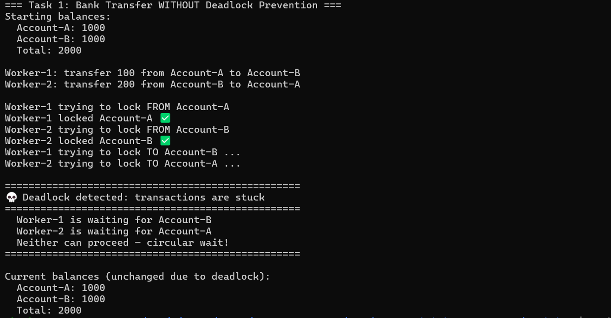
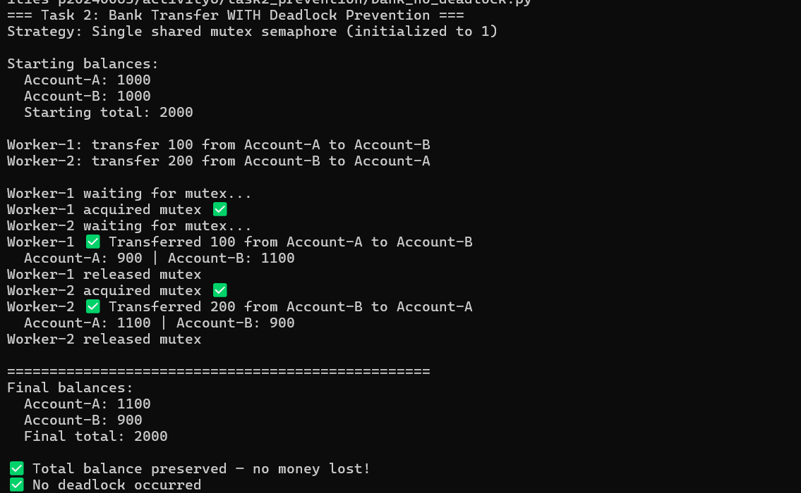

# Class Activity 6 - Deadlock Simulation

- **Student Name:** Kong Sophanha
- **Student ID:** p20240063
- **Programming Language Used:** Python

---

## Task 1: Deadlock Version



- **Shared resources:** Account-A and Account-B
- **Transaction 1:** Transfer 100 from Account-A to Account-B
- **Transaction 2:** Transfer 200 from Account-B to Account-A
- **Deadlock message shown:** Deadlock detected: transactions are stuck
- **Explanation of why the program got stuck:**
  Worker-1 grabbed Account-A and then waited for Account-B.
  At the same time Worker-2 grabbed Account-B and waited for Account-A.
  Neither one could move forward because each was holding exactly what
  the other needed. They just sat there waiting for each other forever,
  which is the classic circular wait deadlock situation.

---

## Task 2: Deadlock Prevention Version



- **Prevention strategy used:** Single shared mutex semaphore
- **Semaphore mutex initial value:** 1
- **Starting total:** 2000
- **Final total:** 2000
- **Did both transfers complete?** Yes
- **Why no deadlock occurred:**
  Instead of each worker locking individual accounts, both workers now
  compete for one shared mutex. Only one worker can hold the mutex at
  a time, so there is never a situation where Worker-1 holds one account
  and Worker-2 holds the other. The circular wait condition is completely
  eliminated and both transfers finish cleanly.

---

## Questions

1. **What are the two shared resources in your bank transaction simulation?**
   Account-A and Account-B are the two shared resources. Both workers
   need access to both accounts to complete their transfers, which is
   exactly what creates the conflict.

2. **Which line or section of your Task 1 program creates hold-and-wait?**
   The hold-and-wait happens right after the first lock is acquired:
```python
