# OS Lab 6 — Linux Security, Users, Groups & File Permissions

**Course:** Operating Systems
**Lab Title:** Linux Security: Users, Groups & File Permissions
**Student Name:** Kongs Ophanha
**Student ID:** p20240063

---

## Task Output Files

- `task1_users.txt`
- `task2_groups.txt`
- `task3_permissions.txt`
- `task3_stat_output.txt`
- `task4_special_bits.txt`
- `task5_acl.txt`
- `security_lab/whoami_suid.c`

---

## Screenshots

### Screenshot 1 — Task 1: User Creation
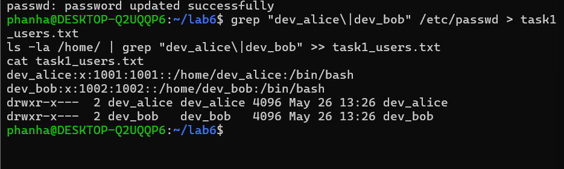

### Screenshot 2 — Task 1: User Modification
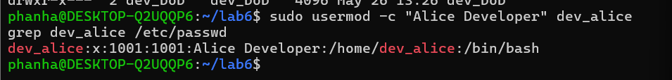

### Screenshot 3 — Task 2: Group Setup
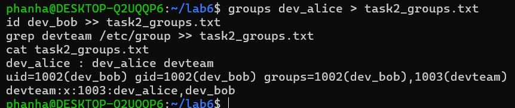

### Screenshot 4 — Task 2: Multiple Group Membership
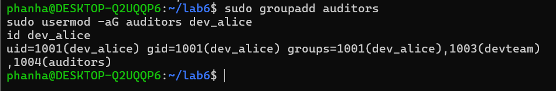

### Screenshot 5 — Task 3: Directory Permissions
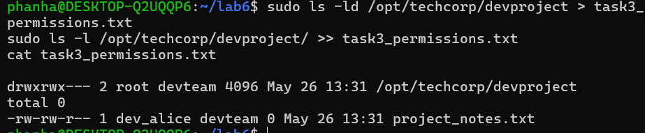

### Screenshot 6 — Task 3: Access Denied
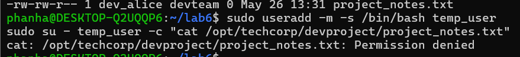

### Screenshot 7 — Task 4: setgid Bit
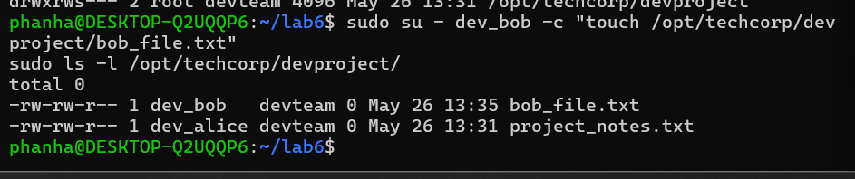

### Screenshot 8 — Task 4: Sticky Bit
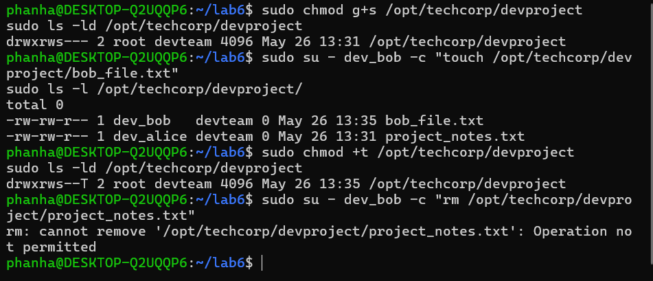

### Screenshot 9 — Task 4: setuid Bit
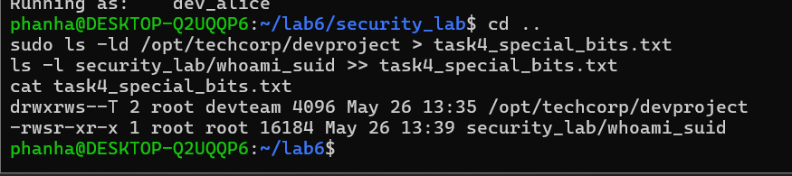

### Screenshot 10 — Task 5: ACL Directory
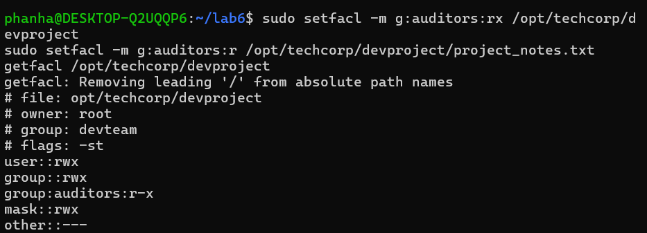

### Screenshot 11 — Task 5: ACL Access Test
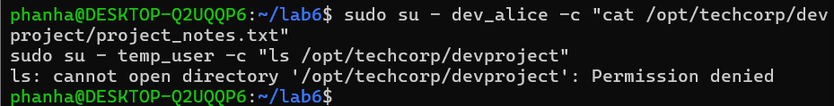

### Screenshot 12 — Task 5: ACL Output File
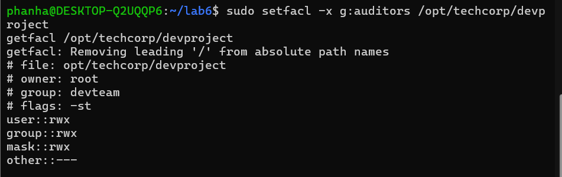

---

## Answers to Lab Questions

### 1. What is the difference between `userdel` and `userdel -r`?

`userdel` removes the user account entry from `/etc/passwd` and `/etc/shadow`, but leaves the user's home directory and mail spool intact on the filesystem. `userdel -r` does everything `userdel` does but also recursively deletes the user's home directory and mail spool. In a production environment, you would use `userdel -r` when fully offboarding a user to avoid orphaned files, but omit `-r` if you need to preserve their data for archival or transfer.

### 2. Why is it safer to use `visudo` instead of directly editing `/etc/sudoers`?

`visudo` locks the `/etc/sudoers` file against simultaneous edits and performs syntax validation before saving. If you introduce a syntax error while editing `/etc/sudoers` directly, `sudo` can become completely broken, locking all users out of privilege escalation. `visudo` catches syntax errors before they are written to disk and refuses to save an invalid configuration, making it far safer for system administration.

### 3. What happens when a `setgid` directory contains files created by different users? What benefit does this provide for team collaboration?

When `setgid` is applied to a directory, new files automatically inherit the group ownership of the directory rather than the primary group of the user who created them. So even if `dev_alice` and `dev_bob` have different primary groups, files they create inside `/opt/techcorp/devproject` will both be owned by `devteam`. This ensures consistent group ownership across all shared files without requiring users to manually run `chown` or `newgrp`, making collaboration seamless.

### 4. What limitation of standard Unix permissions does the ACL system solve?

Standard Unix permissions support only three permission subjects: the owning user, the owning group, and all others. This three-tier model cannot express nuanced access requirements — for example, granting read-only access to a second group like `auditors` on a directory already owned by `devteam`. ACLs solve this by allowing fine-grained permission entries for any number of specific users or groups, without modifying the standard permissions or group ownership.

---

## Folder Structure

\`\`\`
os-se-p20240063/
└── os-lab-p20240063/
    └── lab6/
        ├── README.md
        ├── task1_users.txt
        ├── task2_groups.txt
        ├── task3_permissions.txt
        ├── task3_stat_output.txt
        ├── task4_special_bits.txt
        ├── task5_acl.txt
        ├── security_lab/
        │   └── whoami_suid.c
        └── images/
            ├── task1_user_creation.png
            ├── task1_user_modify.png
            ├── task2_group_setup.png
            ├── task2_multi_group.png
            ├── task3_dir_permissions.png
            ├── task3_access_denied.png
            ├── task4_setgid.png
            ├── task4_sticky_bit.png
            ├── task4_setuid.png
            ├── task5_acl_dir.png
            ├── task5_acl_test.png
            └── task5_acl_output.png
\`\`\`
