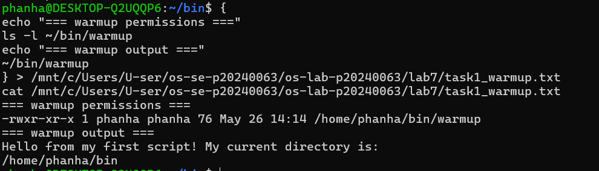
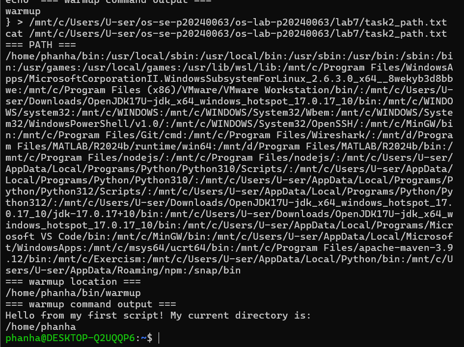
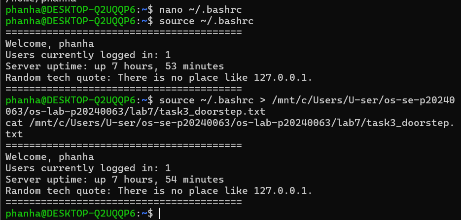
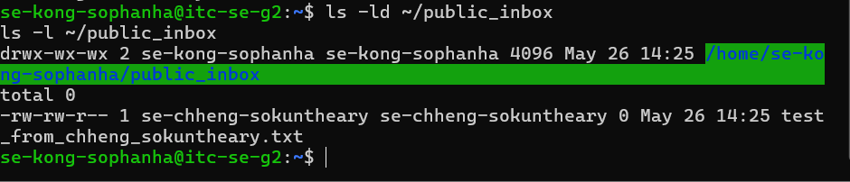
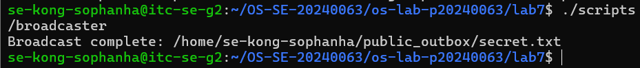
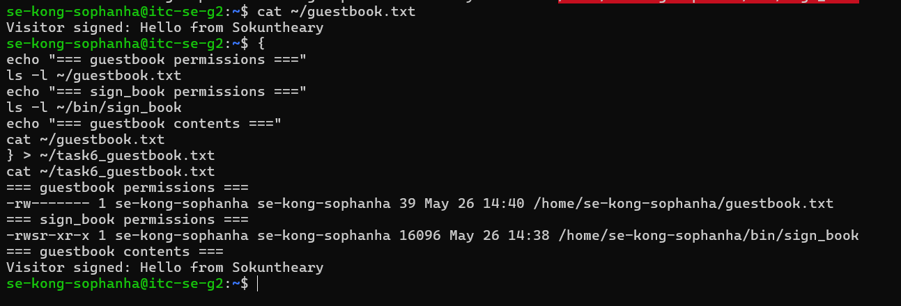
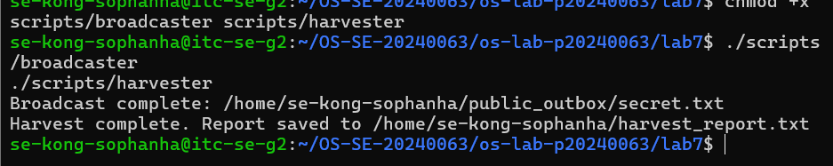
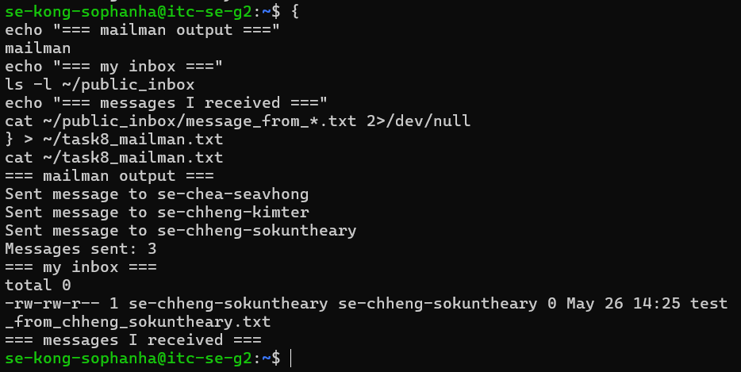

# OS Lab 7 — Bash Scripting, Permissions & Server Automation

**Course:** Operating Systems
**Student Name:** Kongs Ophanha
**Student ID:** p20240063

---

## Task Output Files

- `task1_warmup.txt`
- `task2_path.txt`
- `task3_doorstep.txt`
- `task4_inbox.txt`
- `task5_broadcaster.txt`
- `task6_guestbook.txt`
- `harvest_report.txt`
- `task8_mailman.txt`
- `sign_book.c`
- `scripts/warmup`
- `scripts/broadcaster`
- `scripts/harvester`
- `scripts/mailman`
- `scripts/sign_book_binary`

---

## Screenshots

### Screenshot 1 — Task 1: Warm-Up Script
> Show `cat task1_warmup.txt` with the executable `warmup` script and successful output.

---

### Screenshot 2 — Task 2: PATH Setup
> Show `cat task2_path.txt` with your `PATH`, `which warmup`, and running `warmup` by name.

---

### Screenshot 3 — Task 3: Doorstep Message
> Show `cat task3_doorstep.txt` with username, users online, uptime, and random quote.

---

### Screenshot 4 — Task 4: Secure Mailbox
> Show `cat task4_inbox.txt` with `public_inbox` permissions and a test file from a classmate.

---

### Screenshot 5 — Task 5: Broadcaster
> Show `cat task5_broadcaster.txt` with the broadcaster script evidence and `secret.txt`.

---

### Screenshot 6 — Task 6: VIP Guestbook
> Show `cat task6_guestbook.txt` with guestbook permissions, SUID binary permissions, and guestbook contents.

---

### Screenshot 7 — Task 7: Data Harvester
> Show `cat harvest_report.txt` containing secrets collected from classmates.

---

### Screenshot 8 — Task 8: Mailman Bot
> Show `cat task8_mailman.txt` with mailman output and messages received in your inbox.

---

## Answers to Lab Questions

### 1. Why did `warmup` fail before you added execute permission?
Linux requires the execute (`x`) bit to be set before a file can be run as a program. Without it, the kernel refuses to execute the file even if it contains valid script content. The `chmod +x` command sets this bit, telling the OS the file is allowed to be executed.

### 2. What does adding `~/bin` to `PATH` allow you to do?
It allows you to run scripts in `~/bin` by typing just their name from any directory, without needing to prefix them with `./` or the full path. The shell searches each directory in PATH in order, so placing `$HOME/bin` first means your personal scripts take priority over system commands with the same name.

### 3. Why does `chmod 733 public_inbox` allow classmates to drop files but not list the inbox?
`733` gives others write (`w`) and execute (`x`) permission but not read (`r`). The execute bit on a directory allows entering it and creating files inside, while the missing read bit prevents listing its contents. So classmates can drop files in blindly but cannot see what else is there.

### 4. Why does Linux ignore SUID on shell scripts, and why did we use a compiled C program instead?
Linux ignores SUID on shell scripts for security reasons — a script can be modified or interpreted in unexpected ways, making SUID scripts a serious privilege escalation risk. Compiled C binaries are fixed executables that the kernel can safely run with elevated privileges, so SUID is honored on them.

### 5. What is the difference between `>` and `>>` in Bash redirection?
`>` overwrites the file with new output, deleting any existing content. `>>` appends to the file, preserving existing content and adding new output at the end.

### 6. How did your `harvester` avoid reading files that were missing or not readable?
The harvester used two conditional checks before reading: `[ -f "$target_file" ]` to confirm the file exists and is a regular file, and `[ -r "$target_file" ]` to confirm the current user has read permission. Only if both conditions are true does it attempt to read the file.

### 7. What permission problems did you or your classmates need to fix during the lab?
The main issue was that classmates could not access `~/bin/sign_book` because the home directory was not traversable by default. This was fixed with `chmod 711 $HOME`, which allows others to enter the directory without being able to list its contents.

---

## Reflection

This lab showed how scripting, permissions, and automation work together on a shared Linux server. Setting the right permissions is critical — a single wrong `chmod` can either lock out legitimate users or expose sensitive data. The harvester and mailman scripts demonstrated how automated bots can interact across user boundaries safely, as long as the correct write-only and read-only permissions are in place. The SUID guestbook showed how privilege escalation can be done in a controlled and secure way using compiled binaries rather than scripts.

---

## Folder Structure

\`\`\`
os-se-p20240063/
└── os-lab-p20240063/
    └── lab7/
        ├── README.md
        ├── task1_warmup.txt
        ├── task2_path.txt
        ├── task3_doorstep.txt
        ├── task4_inbox.txt
        ├── task5_broadcaster.txt
        ├── task6_guestbook.txt
        ├── harvest_report.txt
        ├── task8_mailman.txt
        ├── sign_book.c
        ├── scripts/
        │   ├── warmup
        │   ├── broadcaster
        │   ├── harvester
        │   ├── mailman
        │   └── sign_book_binary
        └── images/
            ├── task1_warmup.png
            ├── task2_path.png
            ├── task3_doorstep.png
            ├── task4_inbox.png
            ├── task5_broadcaster.png
            ├── task6_guestbook.png
            ├── task7_harvester.png
            └── task8_mailman.png
\`\`\`
