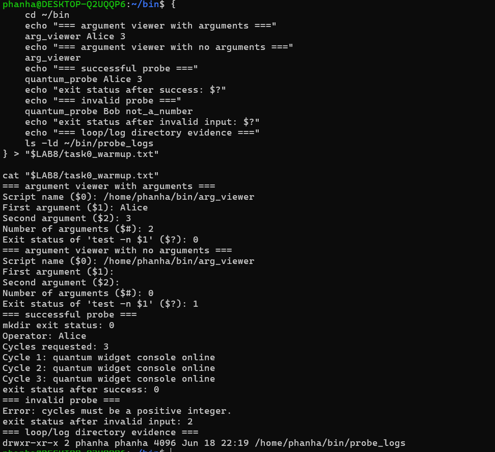
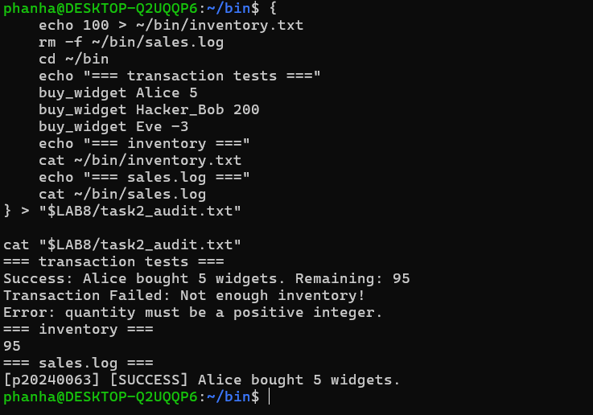
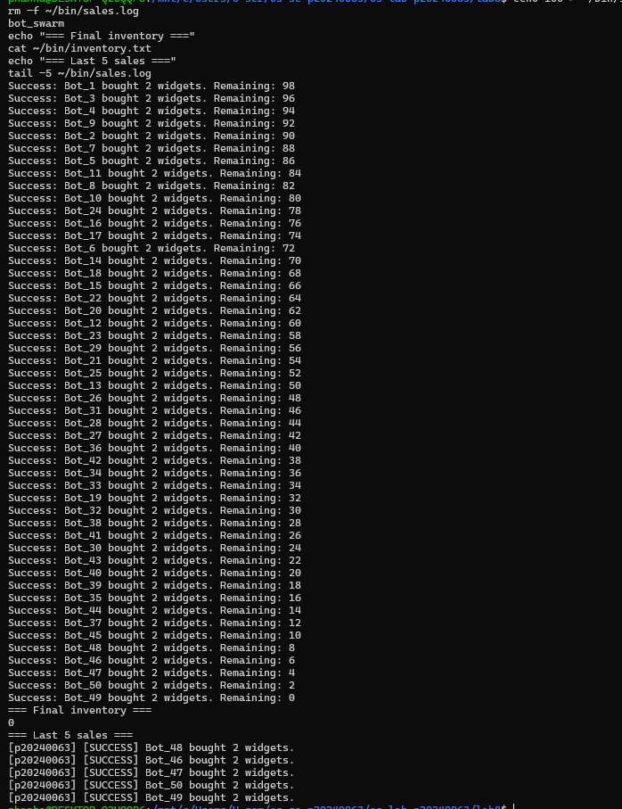
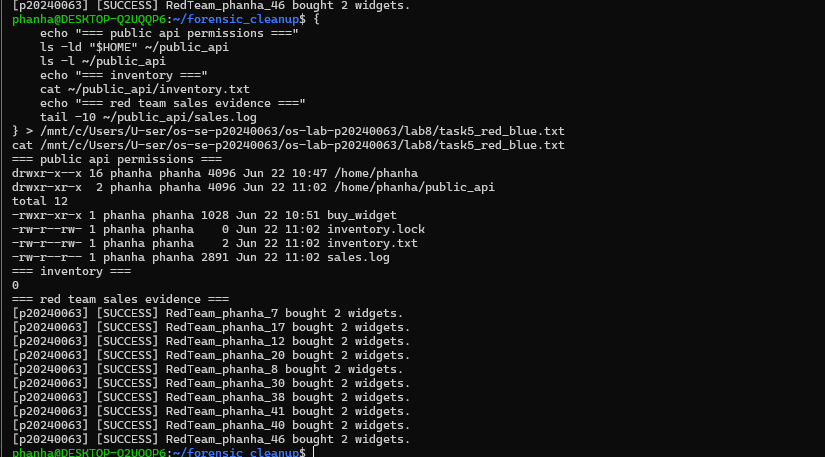
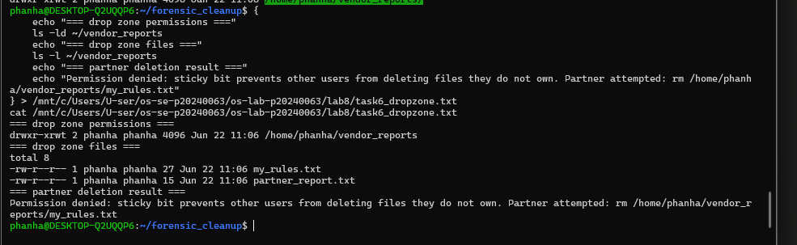
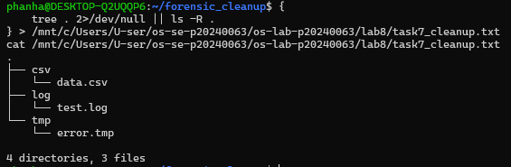

# Lab 8 - Secure Bash Scripting, Race Conditions & File Locking
**Student ID:** p20240063

## Screenshots

## Lab Questions

**1. What does TOC-TOU mean, and where did it appear in the vulnerable buy_widget script?**
TOC-TOU (Time-of-Check to Time-of-Use) is a race condition where the state of a resource changes between when it is checked and when it is used. In buy_widget, multiple processes read inventory.txt at the same time before any writes back, causing over-selling.

**2. Why did bot_swarm sometimes leave inventory values other than 0 before the patch?**
Multiple processes read the same inventory value simultaneously, each approved their purchase, and all subtracted from the same original value — causing negative or inconsistent results depending on OS scheduling.

**3. What part of the script is the critical section, and why must it be protected?**
The read, calculation, and write of inventory.txt is the critical section. It must be protected because concurrent access causes inconsistent results.

**4. How does flock -x enforce mutual exclusion between concurrent processes?**
flock -x acquires an exclusive lock on a file descriptor. Any other process trying to acquire the same lock is blocked until the first process releases it, ensuring only one process executes the critical section at a time.

**5. Which permissions did you use to let a classmate run your API without giving full access?**
chmod o+x on home directory, chmod 755 on public_api, chmod o+rx on buy_widget, and chmod o+rw on inventory.txt, sales.log, and inventory.lock.

**6. Why does the sticky bit protect files in a shared drop zone?**
The sticky bit ensures that only the file owner can delete their own files in a shared directory, even if others have write permission to the directory.

**7. What defensive scripting practice from this lab would you use in a real production script?**
Input validation, file locking with flock, anchoring file paths using script_dir, and audit logging with student/user ID for traceability.
