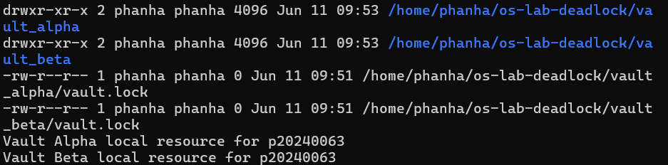
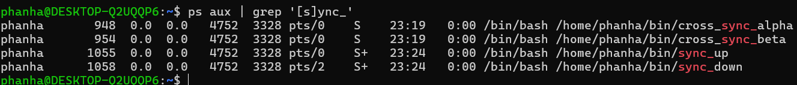
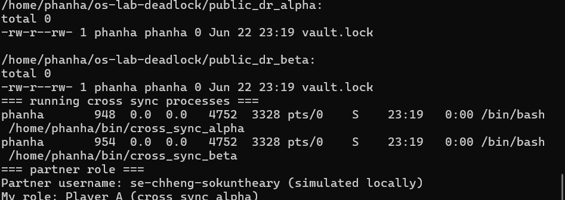
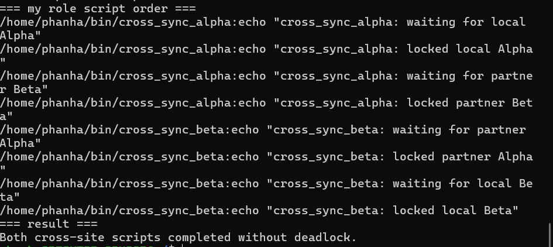
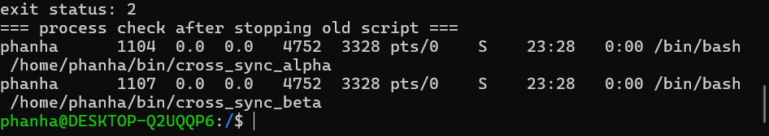
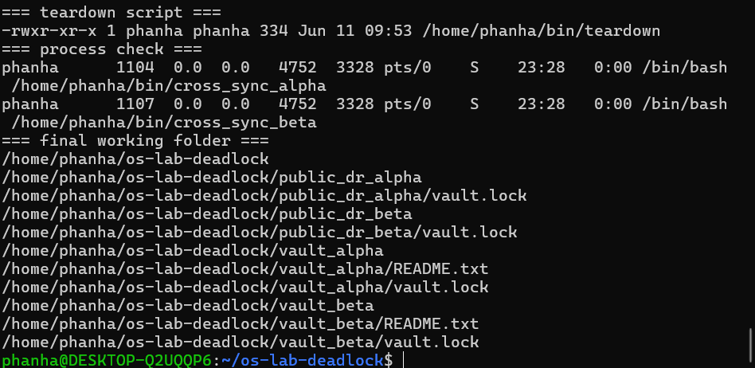

# Lab 9 - Vault Deadlock, Resource Ordering & Recovery
**Student ID:** p20240063

## Screenshots

## Lab Questions

**1. What does each vault.lock file represent in this lab?**
Each vault.lock file represents exclusive access to a shared resource (vault). A process must acquire the lock before entering the critical section.

**2. Why does flock require every script to lock the same shared file to coordinate correctly?**
flock works by locking a specific file. If scripts lock different files, they do not coordinate and cannot block each other.

**3. In the local deadlock, which resource did sync_up hold, and which did it wait for?**
sync_up held Vault Alpha and waited for Vault Beta.

**4. In the local deadlock, which resource did sync_down hold, and which did it wait for?**
sync_down held Vault Beta and waited for Vault Alpha.

**5. Which four deadlock conditions were present in Level 3?**
Mutual exclusion, hold and wait, no preemption, and circular wait.

**6. How does the global Alpha-before-Beta ordering rule break circular wait?**
When every script locks Alpha before Beta, no script can hold Beta and wait for Alpha. This eliminates circular wait entirely.

**7. Why is flock -w useful for recovery even though it does not prevent every deadlock?**
flock -w sets a timeout so a script does not wait forever. It detects that a lock cannot be acquired and exits with an error instead of freezing.

**8. Why should you check for stuck processes before finishing a deadlock lab?**
Stuck processes continue holding locks and consuming resources. They must be stopped to release locks and ensure the system is clean.
